## Grafana Dashboard Documentation: **CSI Driver Metrics**

### 1. **Introduction**
This Grafana dashboard provides an in-depth view of the CSI Driver operations for Linode Block Storage, with real-time data on volume creation, deletion, publication, and expansion. It also tracks persistent volume claims and potential runtime errors. The data is sourced from Prometheus, making it ideal for monitoring and diagnosing issues with CSI Driver operations.

### 2. **Dashboard Structure**
The dashboard is divided into several panels. Each panel focuses on a different aspect of CSI Driver operations, including Create/Delete/Publish Volume requests, runtime operation errors, and Persistent Volume (PV) and Persistent Volume Claim (PVC) events.

---

### 3. **Key Metrics and Visualizations with Graphs**

---

##### **Key points to know in-order to understand the graphs**:

- The y-axis is scaled by 1000. To get the correct number, multiply the decimal by 1000.
- The example graphs are plotted over a period of 48 hours, due to which the x-axis contains date and time.
- The spikes you see happened during e2e tests.

---

#### **Controller Create Volume**

- **Create Volume Requests**  
   - **Description**: Displays the total number of volume creation requests made to the CSI Driver.  
   - **Query**: `csi_sidecar_operations_seconds_count{method_name="/csi.v1.Controller/CreateVolume"}`
   - **Graph**:  
   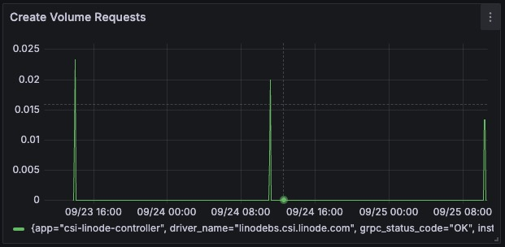
   - **Explanation**: This graph shows the rate of volume creation requests over time. Spikes indicate increased provisioning activity.

- **Total Time Taken to Create Volume**  
   - **Description**: Displays the cumulative time taken to create volumes.  
   - **Query**: `csi_sidecar_operations_seconds_sum{method_name="/csi.v1.Controller/CreateVolume"}`
   - **Graph**:  
   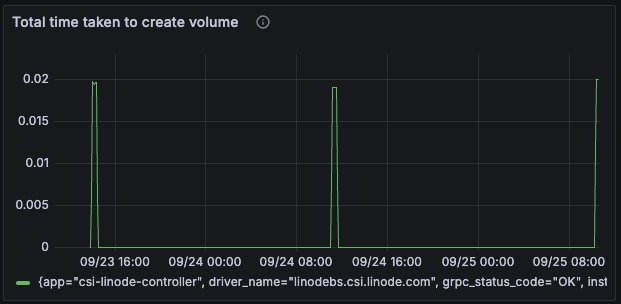
   - **Explanation**: Tracks the total amount of time spent creating volumes, useful for identifying delays in provisioning.

---

#### **Controller Delete Volume**

- **Delete Volume Requests**  
   - **Description**: Shows the number of requests to delete volumes through the CSI Driver.  
   - **Query**: `csi_sidecar_operations_seconds_count{method_name="/csi.v1.Controller/DeleteVolume"}`
   - **Graph**:  
   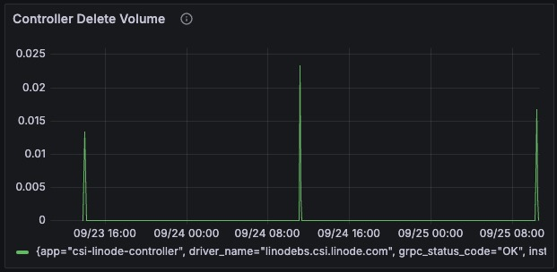
   - **Explanation**: This graph tracks how often volumes are deleted. A consistent increase means regular cleanup of resources.

- **Total Time Taken to Delete Volume**  
   - **Description**: Tracks the time spent deleting volumes.  
   - **Query**: `csi_sidecar_operations_seconds_sum{method_name="/csi.v1.Controller/DeleteVolume"}`
   - **Graph**:  
   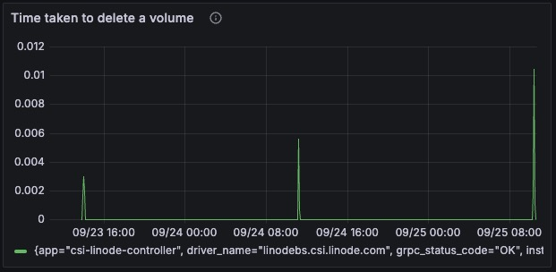
   - **Explanation**: Shows the time taken to delete volumes, highlighting the efficiency of resource cleanup operations.

---

#### **Controller Expand Volume**

- **Expand Volume Requests**  
   - **Description**: Monitors requests to expand volumes.  
   - **Query**: `csi_sidecar_operations_seconds_count{method_name="/csi.v1.Controller/ControllerExpandVolume"}`
   - **Graph**:  
   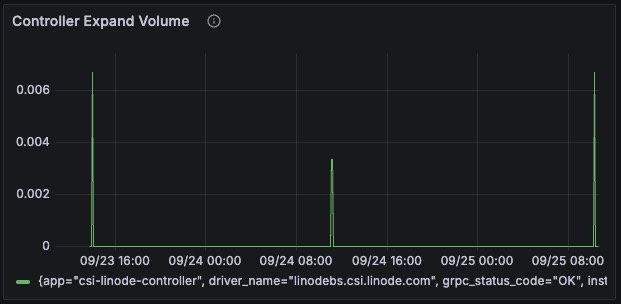
   - **Explanation**: This graph tracks how frequently volume expansion operations occur.

- **Total Time Taken to Expand Volume**  
   - **Description**: Displays the cumulative time taken to expand volumes.  
   - **Query**: `csi_sidecar_operations_seconds_sum{method_name="/csi.v1.Controller/ControllerExpandVolume"}`
   - **Graph**:  
   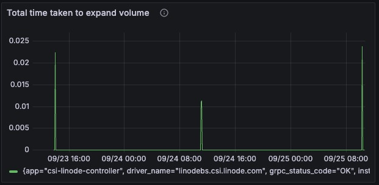
   - **Explanation**: Tracks the total time taken to expand volumes.

---

#### **Controller Publish Volume**

- **Publish Volume Requests**  
   - **Description**: The number of requests made to attach or publish volumes to nodes.  
   - **Query**: `csi_sidecar_operations_seconds_count{method_name="/csi.v1.Controller/ControllerPublishVolume"}`
   - **Graph**:  
   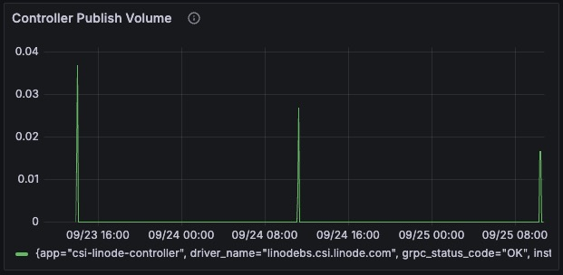
   - **Explanation**: This graph tracks how often volumes are published (attached) to nodes, indicating mounting operations.

- **Total Time Taken to Publish Volume**  
   - **Description**: Displays the cumulative time taken to publish (attach) volumes to nodes.  
   - **Query**: `csi_sidecar_operations_seconds_sum{method_name="/csi.v1.Controller/ControllerPublishVolume"}`
   - **Graph**:  
   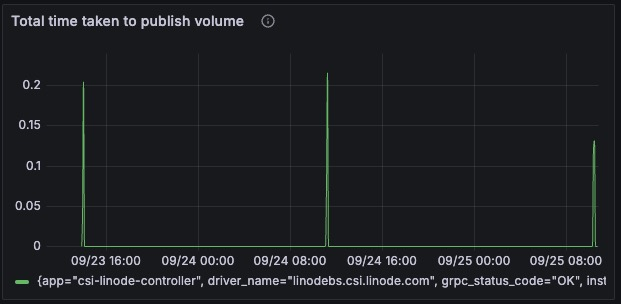
   - **Explanation**: Tracks the total time spent publishing volumes to nodes.

---

#### **Controller Unpublish Volume**

- **Unpublish Volume Requests**  
    - **Description**: Tracks the number of requests to unpublish volumes.  
    - **Query**: `csi_sidecar_operations_seconds_count{method_name="/csi.v1.Controller/ControllerUnpublishVolume"}`
    - **Graph**:  
    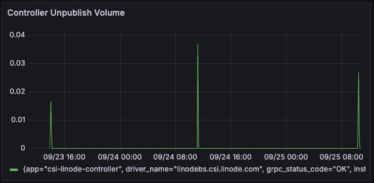
    - **Explanation**: This graph shows how frequently volumes are unpublished (detached) from nodes.

- **Total Time Taken to Unpublish Volume**  
    - **Description**: Displays the cumulative time taken to unpublish (detach) volumes from nodes.  
    - **Query**: `csi_sidecar_operations_seconds_sum{method_name="/csi.v1.Controller/ControllerUnpublishVolume"}`
    - **Graph**:  
    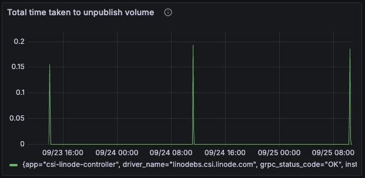
    - **Explanation**: Tracks the total time spent unpublishing volumes from nodes.

---

### 4. **Additional Metrics**

---

#### **Persistent Volumes (PV)**

- **Description**: Displays the total number of PV-related events that the CSI controller processed.  
- **Query**: `workqueue_adds_total{name="volumes"}`
- **Graph**:  
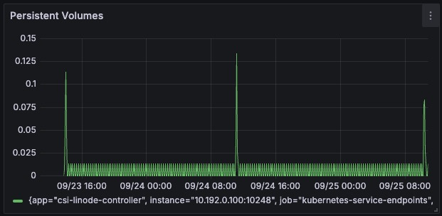
- **Explanation**: This graph shows how many PV requests were made, indicating the provisioning of new storage resources.

---

#### **Volume Claims (PVC)**

- **Description**: Tracks the number of PVC-related events that the controller reconciles.  
- **Query**: `workqueue_adds_total{name="claims"}`
- **Graph**:  
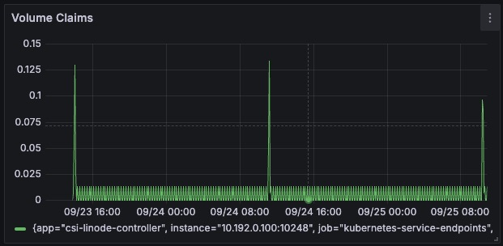
- **Explanation**: This graph tracks PVC-related events, providing insights into the frequency of new claims or bindings.

---

#### **Runtime Operation Errors**

- **Description**: Visualizes errors encountered by the CSI Driver during operations.  
- **Query**: `kubelet_runtime_operations_errors_total`
- **Graph**:  

- **Explanation**: A rise in runtime errors indicates potential issues within the Kubernetes nodes or the CSI components.

---

#### **CSI Sidecar Operations Seconds Sum**

- **Description**: Shows the cumulative time taken for operations handled by CSI sidecars (attacher, provisioner, etc.).  
- **Query**: `csi_sidecar_operations_seconds_sum`
- **Graph**:  
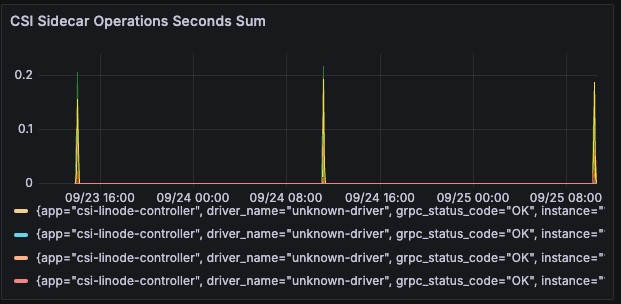
- **Explanation**: This graph tracks the total time consumed by all CSI operations, helping identify potential bottlenecks.

---

### 5. **Missing Metrics/ Future Scope**

---

#### **Volume Utilization Metrics**:
- **Volume Size**: Track the size of volumes currently in use to better understand resource consumption.
- **Potential Implementation**: Metrics could be added to track how much space is being utilized by each volume, ensuring optimal usage and highlighting volumes nearing full capacity.

#### **Node Metrics**:
- **Node Attachments**: Track the total number of volumes attached to each node.
- **Node Publish/Unpublish**: Track how often volumes are published (attached) and unpublished (detached) from nodes, giving better visibility into volume mounting and unmounting operations.
- **Node Stage/Unstage**: Monitor staging and unstaging operations to identify any potential delays or issues when preparing a volume for use on a node.